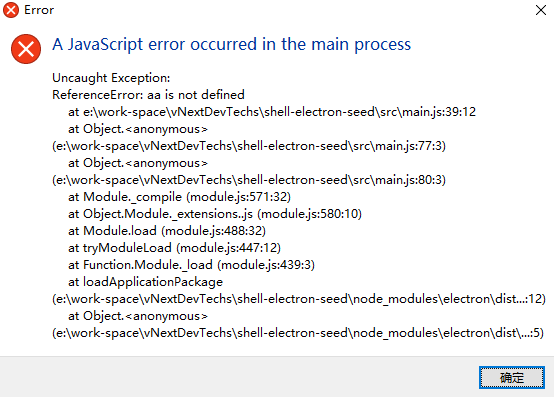

# 壳主线程异常处理方式

在运行壳程序时，一些未捕获的异常会导致electron弹出异常框，如下图，



当然这种异常框是相当不友好的。因此我们需要对electron 主进程未捕获的异常进行处理。

异常分成同步异常和异步异常，处理方案如下，添加exceptionHandler.js
```
module.exports.register = function(logger){
  if(process.type === 'browser'){
    process.on('uncaughtException', function(error){
      logger.info(error);
    })

    process.on('unhandledRejection', function(error){
      logger.info(error);
    })
  }
}
```
有了这个exceptionHandler后，当electron再发生未捕获的异常，不会再弹出以上异常框，且我们可以对异常做定制化处理。